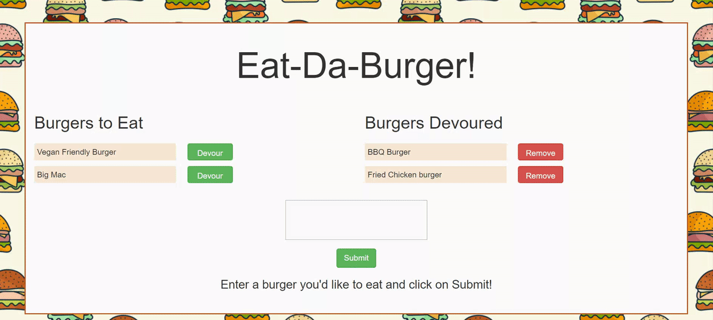

# burger

Eat-Da-Burger! is a restaurant app that lets users log the names of burgers they'd like to eat. Whenever a user submits a burger's name, the app displays the burger on the left side of the page, waiting to be devoured.

Each burger in the waiting area also has a Devour it! button. When the user clicks on 'Devour', the burger will move to the right side of the page.

Once devoured, the user also has the ability to delete the devoured burger from the list and database. If not deleted, the database stores both devoured and non-devoured burgers.

**GIF of application in use**

- Running the application and navigating to survey
  

**Technologies Used**

- HTML/CSS
- javascript
- Express
- Node server
- Handlebars
- mySQL
- Deployed on Heruku

**Link to the Application, Hosted on Heroku**
https://infinite-shore-50342.herokuapp.com/

**Credits**
Developer and app creator: Josh Cosson
